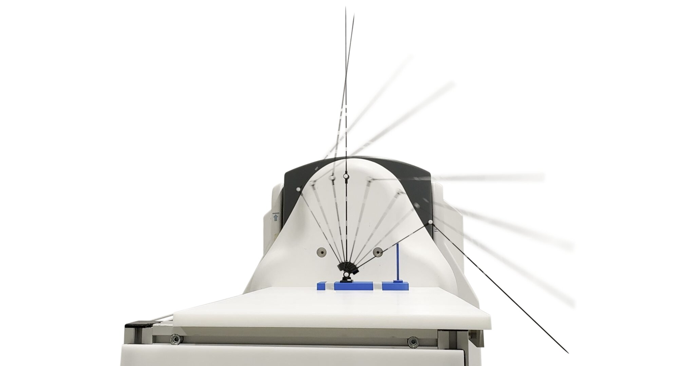
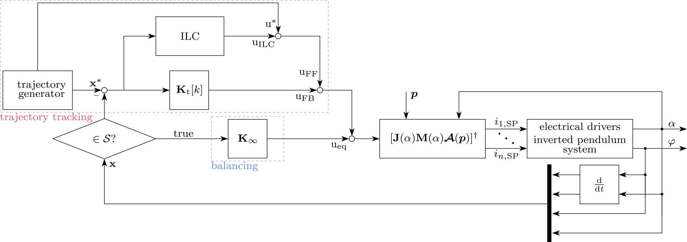
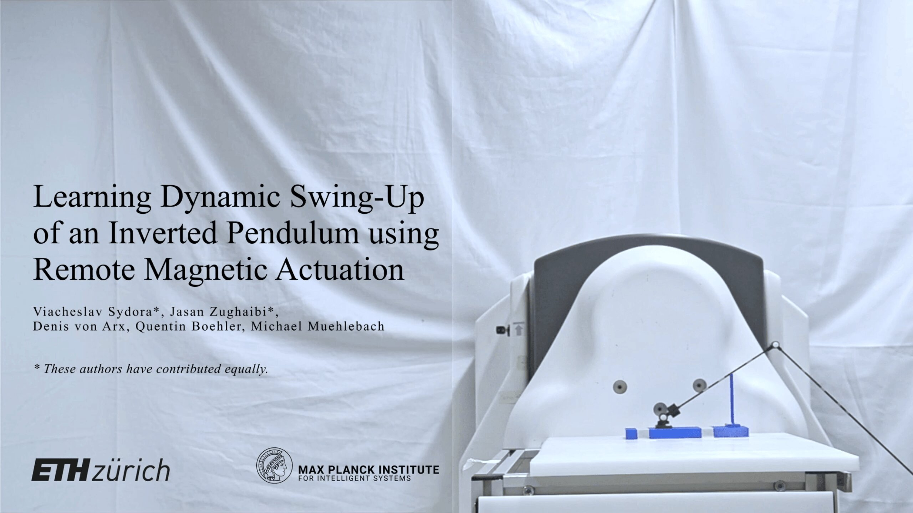

<div align="center">
<h1>Learning Dynamic Swing-Up of an Inverted Pendulum using Remote Magnetic Actuation</h1>

<h4>Viacheslav Sydora<sup>1*</sup>, Jasan Zughaibi<sup>2*</sup>, Denis von Arx<sup>2</sup>, Quentin Boehler<sup>3</sup>, Michael Muehlebach<sup>1</sup></h4>

<sup>1</sup>Learning and Dynamical Systems, Max Planck Institute for Intelligent Systems, Tübingen, Germany<br>
<sup>2</sup>Multi-Scale Robotics Lab, Institute of Robotics and Intelligent Systems, D-MAVT, ETH Zürich, Zürich, Switzerland<br>
<sup>3</sup>Medical Robotics Lab, Institute of Robotics and Intelligent Systems, D-MAVT, ETH Zürich, Zürich, Switzerland<br><br>
*These authors have contributed equally

[Paper (TBD)](#bibtex-citation) | [Video](#the-system-in-action)
</div>

<!-- --- -->

<p align="center">
  <!-- Replace with actual cover image once available -->
  
  
</p>

## Overview

This ROS package implements **iterative learning control (ILC) for the swing-up of an inverted pendulum** actuated by an external electromagnetic navigation system (eMNS). A permanent magnet on the actuator arm interacts with the externally applied field to generate torques that swing the pendulum from hanging to upright and stabilize it there.

Each trial, a disturbance estimate is updated via an iteration-domain Kalman filter and the next feedforward input is computed by solving a constrained convex optimization problem. A time-varying LQR provides real-time feedback along the trajectory.

## Package Structure

```
emns_invpend_swingup/
│
├── analysis/
│   ├── dynamics.ipynb                            Dynamics derivation and linearization notebook
│   └── trajectory/                              Saved trajectory plots and animations from the planner
│
├── experimental_data/                            Data and plotting scripts used for the paper figures
│   ├── data/                                    Per-trial logged CSVs (6 ILC iterations) and repeatability runs
│   ├── plots/                                   Output figures (EPS/PDF) as included in the paper
│   ├── plot_optimal.py                          Fig. 4 — optimal reference trajectory
│   ├── plot_fb.py                               Fig. 5 — open-loop vs. closed-loop repeatability
│   ├── plot_iterations.py                       Fig. 6 — ILC learning progression
│   ├── plot_stabilization.py                    Fig. 7 — final trial: swing-up + balancing
│   └── plot_torque_discrepancy.py               Fig. 8 — learned correction vs. MPEM prediction
│
├── data/
│   ├── actuator/balancing/inf_lqr_gains.csv     Lateral (beta axis) LQR gains
│   └── pendulum/
│       ├── balancing/inf_lqr_gains.csv          Equilibrium LQR gains
│       ├── correction_angles.csv                Steady-state angle offsets (phi_ss, theta_ss)
│       ├── int_torques.csv                      Integrator torque offsets for disturbance rejection
│       └── swingup/trajectory.npz               Pre-computed optimal swing-up trajectory
│
├── launch/
│   ├── pendulum_balancing.launch                Launch equilibrium stabilization node
│   └── pendulum_ILC_swingup.launch              Launch ILC swing-up node
│
├── scripts/
│   ├── pendulum_balancing_node.py               Equilibrium balancing: integrator, disturbance injection
│   └── pendulum_ILC_swingup_node.py             ILC swing-up: trajectory tracking + equilibrium catch
│
├── src/emns_invpend_swingup/
│   ├── geometry_jit.py                          JIT-compiled geometry: quaternion, rotation, magnetic interaction, Jacobians
│   ├── helpers.py                               Lifted representation (F, G matrices), LQR sweep, current allocation
│   ├── numerical.py                             Numba-accelerated pseudo-inverse and utility functions
│   ├── utils.py                                 CSV read/write helpers for gains and calibration data
│   │
│   ├── parameters/
│   │   ├── general.py                           Physical system parameters (masses, lengths, magnet, sampling rate)
│   │   ├── pendulum.py                          Derived dynamic parameters (J, eta, joint stiffness)
│   │   └── trajectory.py                        Trajectory horizon N, duration T, torque bounds
│   │
│   ├── pendulum/
│   │   ├── common.py                            InvertedPendulum: equations of motion, linearization, state-space matrices
│   │   ├── calc_gains.py                        Infinite-horizon discrete LQR gains for pendulum and actuator axes
│   │   └── TrajectoryPlanner.py                 CasADi/IPOPT direct collocation planner with RK4 sub-steps, visualization
│   │
│   └── ilc/
│       ├── IterativeLearningController.py       ILC outer loop: lifted representation, Kalman update, CVXPY optimization
│       ├── DisturbanceKalmanFilter.py           Iteration-domain Kalman filter for disturbance estimation (Eqs. 22–23)
│       └── DataLogger.py                        Per-trial data saving and trajectory plotting
│
└── srv/
    └── SetBoolean.srv                           Custom ROS service for toggling boolean flags at runtime
```

## Installation

This package has been tested on **Ubuntu 20.04** with **ROS Noetic**.
The rest of this section assumes a working ROS Noetic installation and familiarity with creating and building a catkin workspace.

### Dependencies

#### Vicon Bridge
Required to receive pose data from the Vicon motion capture system:
```bash
cd ~/catkin_ws/src
git clone https://github.com/ethz-asl/vicon_bridge.git
```
Connect the PC running the Vicon system to your computer via ethernet and start Vicon Tracker.
If you use a different motion capture system, install its corresponding ROS interface and adapt the VICON topics in the launch files and node accordingly.

#### Magnetic Manipulation Library (MPEM)
Current-to-field mapping uses the Multi-Pole Expansion Model from the Tesla Core collection:
```bash
cd ~/catkin_ws/src
git clone https://github.com/ethz-msrl/Tesla_core_public.git
```
The MPEM implementation is in [`Tesla_core_public/mag_control/mpem`](https://github.com/ethz-msrl/Tesla_core_public/tree/master/mag_control/mpem), which also contains instructions for recording calibration datasets and fitting the model. Place the resulting `.yaml` calibration file for your eMNS platform in `data/` and pass its filename via the `calibration_file_name` launch parameter.

#### Python Dependencies
```bash
pip install cvxpy casadi numba scipy matplotlib
```

### Clone and Build
```bash
cd ~/catkin_ws/src
git clone <repository_url> emns_invpend_swingup
catkin build emns_invpend_swingup
source ~/catkin_ws/devel/setup.bash
```

### Hardware Interface
To interface with the eMNS hardware you need the proprietary driver software from your eMNS manufacturer (e.g. MagnebotiX for OctoMag/JECB). Since it is not publicly available, direct installation instructions cannot be provided here.

The controller publishes desired coil currents over a ROS topic. Implement a hardware interface node that subscribes to this topic and forwards the currents to your coil drivers. The interface is initialized in `pendulum_ILC_swingup_node.py` and `pendulum_balancing_node.py` via:
```python
self.desired_currents_msg, self.currents_publisher, self.publish_currents_impl, shutdown_hook = \
    init_system(self.system_type, self.b_hardware_connected, coil_nrs=self.active_drivers)
```
Set `b_hardware_connected:=false` in the launch file to run without sending currents to hardware.

## Running

### 1 — Equilibrium Balancing

```bash
roslaunch emns_invpend_swingup pendulum_balancing.launch
```

Runtime services:

```bash
# Start integral action (runs for 60 s, then saves torque offsets)
rosservice call /pendulum_balancing_node/trigger_integrator

# Record steady-state angle offsets (runs for 60 s, then saves correction_angles.csv)
rosservice call /pendulum_balancing_node/trigger_angle_correction

# Inject a disturbance pulse sequence for perturbation tests
rosservice call /pendulum_balancing_node/trigger_disturbance
```

**Angle offsets** (`correction_angles.csv`): The VICON coordinate frame's z-axis may not be perfectly aligned with the gravitational vector — a small misalignment appears as a constant bias in the measured angles phi and theta \[zughaibi25\]. `trigger_angle_correction` records the mean angles over 60 s while the system balances and saves them as correction offsets subtracted from all subsequent measurements.

**Integrator torques** (`int_torques.csv`): A standard integral action runs in parallel with the LQR to eliminate any steady-state torque offset that pure proportional-derivative feedback cannot reject \[zughaibi25\]. `trigger_integrator` runs the integrator for 60 s, then saves the converged torque values so they can be preloaded in later sessions without re-running the integrator.

### 2 — ILC Swing-Up

```bash
roslaunch emns_invpend_swingup pendulum_ILC_swingup.launch
```

Iteration sequence:

```bash
# Initialize: plan/load trajectory, build lifted model (F, G), compute LQR gains
rosservice call /pendulum_ILC_swingup_node/ilc_init

# --- repeat for each ILC trial ---

# Begin recording the trial
rosservice call /pendulum_ILC_swingup_node/start_trial

# ... trial runs automatically until k = N (or early termination) ...

# Compute effective trial length N_j from the recorded data
rosservice call /pendulum_ILC_swingup_node/process_current_trial

# Kalman update → CVXPY optimization → save ũ_{j+1} to disk
rosservice call /pendulum_ILC_swingup_node/ilc_step
```

Toggle equilibrium LQR feedback during a session:
```bash
rosservice call /pendulum_ILC_swingup_node/switch_eq_feedback "value: true"
```

### Key Launch Parameters

| Parameter | Default | Description |
|---|---|---|
| `system_type` | `"JECB"` | Platform: `"Navion"` (3-coil) or `"JECB"` (9-coil) |
| `calibration_file_name` | `"octomag_5point.yaml"` | MPEM calibration file name |
| `vicon_callback_topic_actuator` | — | VICON topic for the actuator arm |
| `vicon_callback_topic_pendulum` | — | VICON topic for the pendulum arm |
| `b_hardware_connected` | `false` | Set `true` to send currents to real hardware |
| `b_southpole_up` | `false` | Flip torque sign for south-pole-up magnet mounting |
| `trajectory_path` | `null` | Path to `.npz` trajectory; if `null`, planner runs on `ilc_init` |
| `trajectory_feedback_enabled` | `false` | Enable time-varying LQR along trajectory |
| `equilibrium_feedback_enabled` | `false` | Enable equilibrium LQR catch at top |
| `verbose` | `false` | Publish all state/torque/trajectory topics (not just process time) |

## The System in Action

<p align="center">
  <a href="https://youtu.be/f0wrxi1No0U">
    
  </a>
</p>

<p align="center">
  <a href="https://youtu.be/f0wrxi1No0U">Watch the demo on YouTube</a>
</p>

## References

The ILC algorithm:
> Schoellig, A.P., Mueller, F.L., D'Andrea, R. (2012). *Optimization-based iterative learning for precise quadrocopter trajectory tracking.* Autonomous Robots 33(1–2):103–127. [DOI 10.1007/s10514-012-9283-2](https://doi.org/10.1007/s10514-012-9283-2)

Steady-state offset correction and integrator torques:
> Zughaibi, J., Nelson, B.J., Muehlebach, M. (2025). *Dynamic Electromagnetic Navigation.* IEEE Robotics and Automation Letters 10(6):6095–6102. [DOI 10.1109/LRA.2025.3563130](https://doi.org/10.1109/LRA.2025.3563130)

Geometry and magnetic interaction utilities adapted from the `oct_levitation` software package:
> Singh, N., Zughaibi, J., von Arx, D., Nelson, B.J., Muehlebach, M. (2025). *Remote Magnetic Levitation Using Reduced Attitude Control and Parametric Field Models.* arXiv:2512.15207. [arXiv:2512.15207](https://arxiv.org/abs/2512.15207)

## Acknowledgements

The authors thank António Bernardes for his assistance with magnetic field calibration and Thomas Steinbrenner for his hardware design support. Michael Muehlebach acknowledges financial support from the German Research Foundation, and Jasan Zughaibi thanks the Max Planck ETH Center for Learning Systems and the Swiss National Science Foundation (Grant IZLCZ0_206033).

## BibTeX Citation

If you use this work, please cite our paper (link TBD):

```bibtex
@article{sydora26,
  author  = {Sydora, Viacheslav and ...},
  title   = {Learning Dynamic Swing-Up of an Inverted Pendulum using Remote Magnetic Actuation},
  journal = {TBD},
  year    = {2026},
}
```
